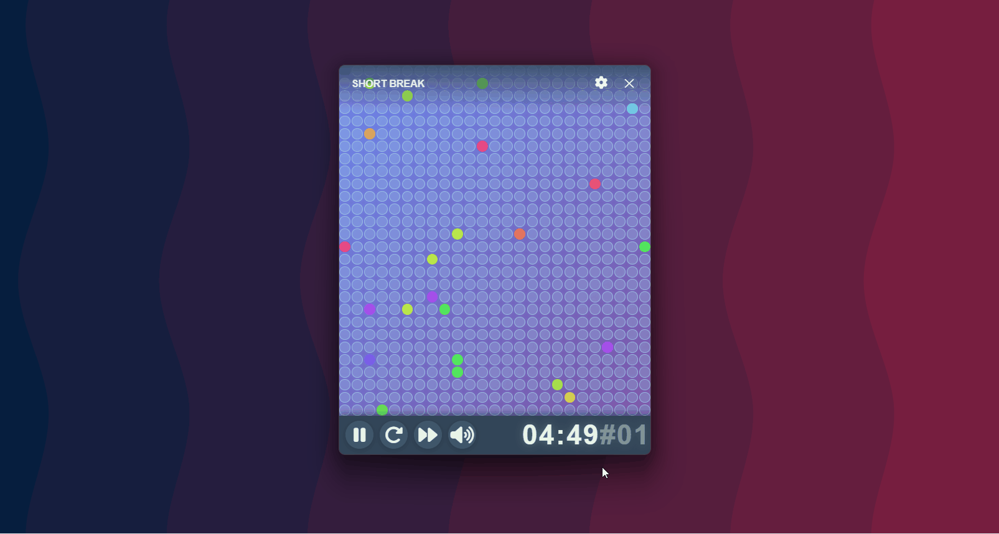

# Pomodoro Timer App

A beautiful and functional Pomodoro timer application built with Tauri (Rust + TypeScript) and created entirely by AI. This app helps you stay focused and productive using the Pomodoro Technique.



## Features

### 🎯 Core Functionality
- **Pomodoro Technique**: 25-minute work sessions with 5-minute breaks
- **Session Management**: Long breaks (15 minutes) after every 4th work session
- **Automatic Switching**: Seamless transitions between work and break sessions
- **Session Counter**: Track your work sessions with visual session numbers

### 🎨 Visual Experience
- **Dynamic Mesh Visualization**: Beautiful animated grid that fills up during sessions
- **Theme Switching**: Automatic color scheme changes between work and break modes
- **Smooth Animations**: Fluid transitions and mesh clearing effects
- **Custom Titlebar**: Clean, modern interface with close button

### ⚙️ Settings & Customization
- **Settings Menu**: Full-screen settings panel accessible via the gear icon in the titlebar.
- **Timer Duration Settings**: Customize work, break, and long break durations.
- **Sound Settings**: Separate toggles for work sounds and break sounds.
- **Modern UI**: Blurred dark background with smooth animations and no scrollbars.
- **Responsive Design**: Settings menu adapts to different screen sizes.

### 🔊 Sound Features
- **Tick Sound**: A subtle ticking sound plays every second during work sessions (when work sounds enabled) and break sessions (when break sounds enabled).
- **Break Sound**: A gentle chime plays at the start of each break session.
- **Long Break Sound**: A distinct sound plays at the start of each long break session.
- **Sound Toggle**: Instantly mute or unmute all sounds using the sound toggle button in the timer controls.
- **Independent Control**: Separate settings for work sounds and break sounds.

### ⌨️ Keyboard Shortcuts
- **ESC**: Exit the application
- **Space**: Start/pause the timer
- **R**: Reset the current session
- **S**: Skip to the next session

### ⚡ Performance
- **Web Workers**: Separate threads for timer and mesh rendering
- **Optimized Updates**: Throttled mesh updates for smooth performance
- **Responsive Design**: Adapts to different window sizes

## Installation & Usage

### Prerequisites
- [Node.js](https://nodejs.org/) (v16 or higher)
- [Rust](https://rustup.rs/) (for Tauri development)
- [Git](https://git-scm.com/)

### Quick Start

1. **Clone the repository**
   ```bash
   git clone <repository-url>
   cd Pomodoro/app
   ```

2. **Install dependencies**
   ```bash
   npm install
   ```

3. **Run in development mode**
   ```bash
   npm run tauri dev
   ```

4. **Build for production**
   ```bash
   npm run tauri build
   ```

### How to Use

1. **Start a Work Session**: Click the play button or press **Space**
2. **Pause/Resume**: Click the play button again or press **Space**
3. **Reset**: Click the stop button or press **R**
4. **Skip Session**: Click the skip button or press **S**
5. **Open Settings**: Click the gear icon in the titlebar
6. **Close App**: Click the X button or press **ESC**

### Session Pattern
- **Work Session**: 25 minutes of focused work
- **Short Break**: 5 minutes (after 1st, 2nd, and 3rd work sessions)
- **Long Break**: 15 minutes (after the 4th work session)
- **Cycle Repeats**: After 4 work sessions, the cycle starts over

## Technical Details

### Architecture
- **Frontend**: TypeScript + Vite
- **Backend**: Rust with Tauri
- **Workers**: Web Workers for timer and mesh rendering
- **Styling**: CSS with modern animations

### Key Components
- `main.ts`: Main application logic and UI interactions
- `timer-worker.ts`: Timer countdown and session management
- `mesh-worker.ts`: Mesh visualization calculations
- `lib.rs`: Rust backend with exit command
- `styles.css`: Modern styling with theme support

## Development

### Project Structure
```
app/
├── src/
│   ├── main.ts              # Main application logic
│   ├── timer-worker.ts      # Timer Web Worker
│   ├── mesh-worker.ts       # Mesh Web Worker
│   └── styles.css           # Application styling
├── src-tauri/
│   └── src/
│       └── lib.rs           # Rust backend
└── package.json
```

### Building
```bash
# Development
npm run tauri dev

# Production build
npm run tauri build

# Preview production build
npm run tauri preview
```

## Changelog

### Version 1.3.1 (Latest)
- 🛠️ Fix: Resolve TypeScript build errors in `main.ts` (null checks and settings inputs)
- 🔊 Behavior: Tick sound plays based on settings for work and breaks
- 📦 Release stability improvements

### Version 1.3.0
- ✨ **New Settings Menu**: Full-screen settings panel with gear icon in titlebar
- ⚙️ **Customizable Timer Durations**: Adjust work, break, and long break durations
- 🔊 **Enhanced Sound Control**: Separate toggles for work sounds and break sounds
- 🎨 **Modern UI**: Blurred dark background with smooth animations
- 🔧 **Improved Sound Logic**: Tick sounds now play during breaks when break sounds are enabled
- 🎯 **Better UX**: No scrollbars in settings menu, responsive design

### Version 1.0.0
- 🎯 **Core Pomodoro Functionality**: 25-minute work sessions with 5-minute breaks
- 🎨 **Dynamic Mesh Visualization**: Beautiful animated grid
- 🔊 **Sound Features**: Tick sounds, break sounds, and long break sounds
- ⌨️ **Keyboard Shortcuts**: Full keyboard navigation support
- ⚡ **Performance**: Web Workers for smooth operation

## Releases

### Creating a Release

The app uses GitHub Actions for automated releases. To create a new release:

#### Using the Release Script (Recommended)

**On Windows:**
```bash
scripts\release.bat 1.0.0
```

**On Linux/macOS:**
```bash
chmod +x scripts/release.sh
./scripts/release.sh 1.0.0
```

#### Manual Release Process

1. **Update version numbers:**
   ```bash
   cd app
   npm version 1.0.0 --no-git-tag-version
   ```

2. **Update Tauri config version** in `app/src-tauri/tauri.conf.json`

3. **Create and push a tag:**
   ```bash
   git add .
   git commit -m "Release version 1.0.0"
   git tag -a "v1.0.0" -m "Release version 1.0.0"
   git push origin v1.0.0
   ```

4. **GitHub Actions will automatically:**
   - Build the app for Windows, macOS, and Linux
   - Create a GitHub release with all artifacts
   - Generate release notes

### Release Artifacts

Each release includes:
- **Windows**: `.exe` and `.msi` installers
- **macOS**: `.dmg` installer
- **Linux**: `.AppImage` and `.deb` packages

### Supported Platforms

- ✅ Windows 10/11 (x64)
- ✅ macOS 10.15+ (x64)
- ✅ Linux (Ubuntu 18.04+, AppImage)

## AI Creation

This entire application was created by an AI assistant using Claude Sonnet 4. The AI designed, implemented, and optimized all aspects of the application including:

- **Frontend Development**: TypeScript, CSS, and Web Workers
- **Backend Development**: Rust with Tauri integration
- **UI/UX Design**: Modern interface with animations and themes
- **Performance Optimization**: Efficient rendering and state management
- **Feature Implementation**: Complete Pomodoro functionality

The AI handled all aspects of development from initial concept to final implementation, demonstrating the capabilities of AI-assisted software development.

## Contributing

While this app was created by AI, contributions are welcome! Feel free to submit issues, feature requests, or pull requests.

## Support

If you encounter any issues or have questions about the application, please open an issue in the repository.

---

**Built with ❤️ by AI** 🤖
